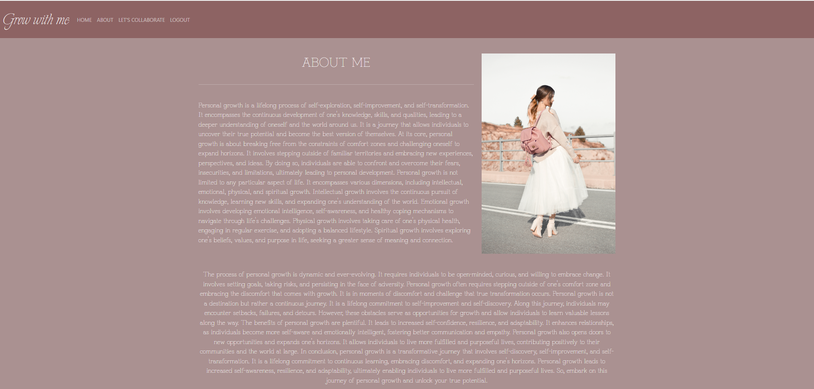
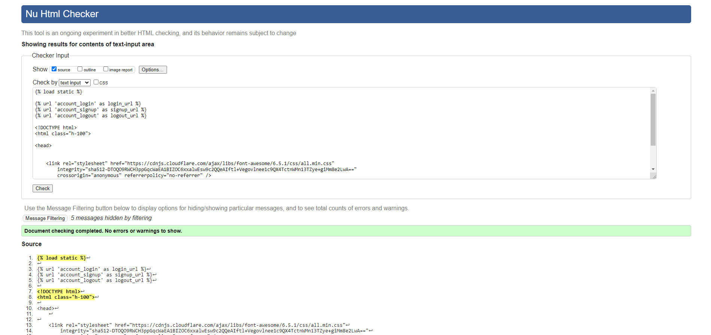
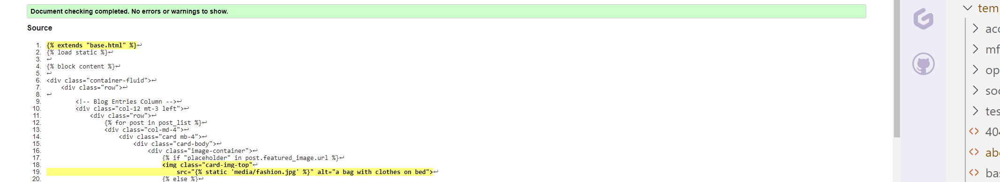
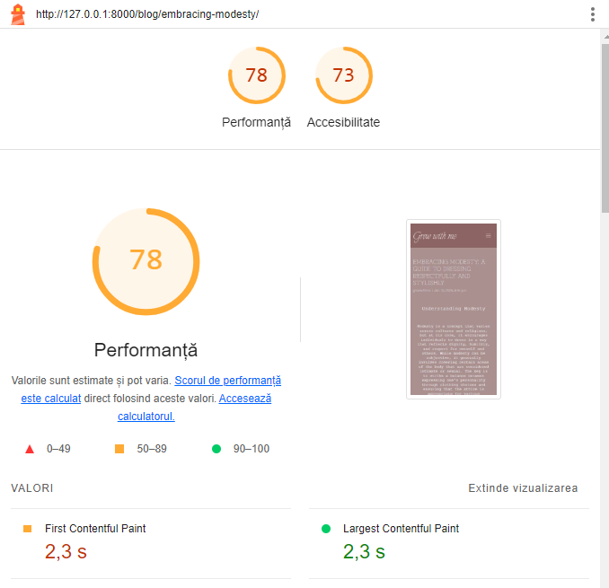

# Grow With Me

[Link to the website](https://growwithme-33cbf82d7376.herokuapp.com/)

## Table of Contents

0. [About](#about)

1. [Project Goals](#project-goals)

   1. [User Goals](#user-goals)

2. [User Experience](#user-experience)

   1. [Target Audience](#target-audience)
   2. [User Requirements and Expectations](#user-requirements-and-expectations)
   3. [User Stories](#user-stories)
   4. [Site Owner Stories](#site-owner-stories)

3. [Wireframes](#wireframes)
4. [Technologies Used](#technologies-used)

   1. [Languages & Frameworks](#languages--frameworks)
   2. [Libraries & Tools](#libraries--tools)
   3. [All Libraries for Deployment](#all-libraries-for-deployment-in-heroku)

5. [Design](#design)

   1. [Colors](#colours)
   2. [Fonts](#fonts)

6. [Project Structure](#project-structure)

   1. [Web Pages](#web-pages)
   2. [Code Structure](#code-structure)

7. [Agile Design](#agile-design)

8. [Database](#database)

   1. [Data Models](#data-models)

9. [Features](#features)

   1. [Implemented Features](#implemented-features)
   2. [Features To Be Implemented](#features-to-be-implemented)

10. [Validation](#validation)

    1. [CSS](#css)
    2. [HTML](#html)
    3. [Python](#python)
    4. [JS](#js)
    5. [Lighthouse](#lighthouse)

11. [Testing](#testing)

12. [Deployment](#deployment)

    1. [Creating database using ElephantSQL](#creating-database-using-elephantsql)
    2. [Deploying in Heroku](#deploying-the-website-in-heroko)
    3. [Forking of Github repo](#forking-the-github-repository)
    4. [Cloning the Github repo](#cloning-the-repository-in-github)

13. [Credits](#credits)

    1. [Content](#content)
    2. [Media](#media)
    3. [Code](#code)

14. [Thank You](#thank-you)

# About

- Grow With Me is a blog for lifestyle helping people with different categories like Parenting, Skincare, how to choose Modest Fashion and books recommandation for personal growth
- The website is build so that user can add posts choosing to write in one of these four categories

# Project Goals

Primary goals of the project (web app):

- Give users  an online platform to read helpful posts about lifestyle
- Enable users to express themselves through a written form Comment or Stories

## User Goals

- Ability to share their stories
- Be able give an opinion on a topic
- Ability to amend and update content
- Able to add, edit and delete their comments
- Able to like or unlike to posts
- Able to collaborate by filling out the collaboration form

## User Experience

### Target Audience

- People around the world who need help or who want to grow personaly
- Individuals who want to share their stories to the world

### User Requirements and Expectations

- Blog with a clear purpose
- An user-friendly interface that allows quick and efficient navigation
- Responsive and visually good design
- Engaging content within the limits of set categories

### User stories

1. As a Site User I want the navigation to be user-friendly so that I'm able to easily navigate through the blog content.
2. As a Site User I want to know info on what the app is about so that I can use its functionality for mutual benefit
3. As a Site User I can be able to register, login and logout from the website so that I can have a safe environment to work with
4. As a Site User I can be able to send message so that I can have my opinion
5. As a Site User I can view the category so that I can choose in witch categorie I want to read a post
6. As a Site User I can click a story so that I can read the full post
7. As a Site User I can comment on the story so that I can be involved in conversation
8. As a Site User I can delete comments so that I can delete unwanted comments in my story and also my comments in other's stories
9. As a Site User I can add a story so that I can share my thoughts with different people
10. As a Site User I can edit my story so that I can change the content when I want
11. As a Site User I can be able delete my story so that I can delete my blog when needed
12. As a Site User I can be able to add my profile to the website so that I can interact comfortably
13. As a Site User I can be able to edit and update my profile so that I can change details whenever I want
14. As a Site User I can delete my posts if I decide that the posts is not good enought to publish
15. As a Site User I can delete my posts if I decide that the posts is not good enought to publish
16. As a site User I can put my post to draft if I decide to finish to write it in another day.

### Site Owner Stories

1. As a Site Owner I would like that authenticated users have full access to blog app and its functionality
2. As a Site Owner I would like that users can leave a message via collaboration form
3. As a Site Owner I would like that each authenticated user gets prompt messages when performing CRUD(Create,Read,Update,Delete) operations when using blog app.
4. As a Site Owner I would like to approve or disapprove comments on my posts

## Wireframes

- A wireframe was build before developing the website.
- This was done in Canva.
- I didn't have time to aply this design, but in th future I would like to make this blog design as I made in Canva 

Index Page

Conclusion Page

Register/Login Page

Dashboard Page

About Page

Collaboration Page

- I didn't thing first time to make a collaboration form so I made contact form in my design

Stories Page

Story Detail Page

# Technologies Used

## Languages & Frameworks

- HTML
- CSS
- Javascript
- Boostrap 5
- Python 
- Django

### Libraries & Tools

- Canva App was usedfor creating the multi-device mock-up at the top of this README.md file and design for my app
- [Bootstrap 5](https://getbootstrap.com/). This project uses the Bootstrap library for UI components (Buttons, Card, Footer, Pagination, Navbar)
- [Cloudinary](https://cloudinary.com/) to store static files
- [Summernote](https://summernote.org/) to style the admin page
- [Favicon.io](https://favicon.io) for making the site favicon
- [Chrome dev tools](https://developers.google.com/web/tools/chrome-devtools/) was used for debugging of the code and checking site for responsiveness
- [Font Awesome icons](https://fontawesome.com/) - Icons from Boostrap icons were used throughout the site
- [GitPod](https://www.gitpod.io/) was used for writing code and to push the code to GitHub
- [GitHub](https://github.com/) was used as a remote repository to store project code
- [Google Fonts](https://fonts.google.com/) - for typography in project

### All libraries for deployment in Heroku

- All libraries is stored in requirements.txt for deployment in heroku

All libraries

# Design

## Colours

The colours from the app is inspired from Canva

## Fonts

Google fonts "'Explora', sans-serif" is used for logo from the navbar and 'Grandiflora One', 'Lora' fonts were used for this project as it offers clean and legible design, which makes it easy to read on screens of different sizes and resolutions. It has a neutral appearance and doesn't have any distracting features that can make it difficult to read.

## Project Structure

### Web Pages

The web pages are easy to navigate and consists of various pictures for better visual of the website.

### Sections

##### Index page

- A navbar with nav-items to navigate to various pages in the website
- Hero Section consist of two images and a button to redirect user to conclusion page
- Our Conclusion page explain about what is this blog app
- Footer with copyrights ,social media and useful navigation links

##### Conclusion Page

- A navbar with nav-items to navigate to various pages in the website
- A section with story post about the blog app
- Footer with social media and useful navigation links

##### Register/Login Page

- A navbar with nav-items to navigate to various pages in the website
- A form for register/login
- Footer with social media and useful navigation links

##### Dashboard Page

- A navbar with nav-items to navigate to various pages in the website
- A menu with four categories (Books Recommendation, Modest fashion, Skincare and Parenting)
- Footer with social media and useful navigation links

##### About Page

- A navbar with nav-items to navigate to various pages in the website
- Story of the site owner and a picture
- Footer with social media and useful navigation links

##### Our Stories Page

- A navbar with nav-items to navigate to various pages in the website
- A card display of stories written by users
- Footer with social media and useful navigation links

##### Our Stories Page

- A navbar with nav-items to navigate to various pages in the website
- Cards display of stories written by users
- Footer with social media and useful navigation links

##### Story Detail Page

- A navbar with nav-items to navigate to various pages in the website
- Posts display of stories written by users with images
- A Comment form
- Like or Dislike posts button
- Comments posted or waiting approval
- Edit or delete buttons for comments
- Footer with social media and useful navigation links

##### Collaboration Page

- A navbar with nav-items to navigate to various pages in the website
- A collaboration form to collaborate with the site owner

##### Logout Page

- A navbar with nav-items to navigate to various pages in the website
- A text asking user if it's shure that he want to logout and a button to logout

### Code structure

Project code structure is organized and constructed using Django Framework

#### Project Apps

- Blog app - constructed to deliver basic information for the User about the app with simple an intuitive navigation(links in nav-bar and footer to navigate throughout the app).

  It also provides the following functionalities:

  1. basic collaboration form for user to send a collaboration request and a footer
  2. user authentication and profile management functionality, full CRUD functionality, so user can create an account, update profile, upload supporting images for a profile

  3. the structure includes the necessary files for running the application, including the views, models, and templates required to create, read, update, and delete blog posts and comments.

#### Other django apps

- **settings.py**: This file contains configuration settings for your Django project, such as database settings, installed apps, and middleware.
- **Procfile**: This file is used to specify the commands that should be executed when your Django app is deployed on a hosting platform.
- **static**: This directory contains the base CSS JavaScript files and media
- **templates**- base-level folder with basic templates extended throughout other templates like: base.html, index.html, dashboard.html and others, also templates for user authentication.
- **requirements.txt**: This file lists the dependencies required for the Django project to run.
- **env.py**: This file is used to store environment variables for a Django project or application, such as database connection details or API keys.

##### Back to [top](#table-of-contents)

## Agile design

### About

- Agile development is the most effective way to development of any website
- It was my first attempt and I found it very challenging but somehow was able to do basic development in agile environment
- I forgot to set milestones in first instance and started the project without it. Hopefully in upcoming projects, I can be able to do it better.
- I have followed the "Think Before I Blog" project by Code Institute and just did it wth User story template.
- I was able to provide labels to user stories but in later stage of project
- I am aware that planning can be better and clear and will be implementing the agile development better from next project.

## Database

---

(ERD)Physical database model

- This sample ERD diagram was made using [Lucid Charts](https://www.lucidchart.com)
- For this Django app I ve used PostgreSQL relational database management system.
- model showed on the diagram visually represents the structure of a PostgreSQL database, including tables, columns, relationships, and constraints, that is stored in the database itself.

### Data Models

#### User Model

- User model as part of the Django allauth library contains basic information about authenticated user and contains folowing fields:
  Username, Password, Email

#### Profile model

- Profile model is created for user to add their details and image for better interaction with the website

| Name          | Database Key  | Field Type      | Validation                          |
| ------------- | ------------- | --------------- | ----------------------------------- |
| user          | user          | OneToOneField   | User, on_delete=models.CASCADE      |    |
| first_name    | first_name    | CharField       | max_length=50 blank=True            |
| last_name     | last_name     | CharField       | max_length=50 blank=True            |
| email         | email         | EmailField      | max_length=100 null=True blank=True |

#### Post model

- Post model is created for user to add a story with a image

| Name        | Database Key | Field Type      | Validation                                         |
| ----------- | ------------ | --------------- | -------------------------------------------------- |
| title       | title        | CharField       | max_length=200, unique=True                        |
| author     | author      | ForeignKey      | User, on_delete=models.CASCADE, related_name="blog_posts"                     |
| slug        | slug         | SlugField       | max_length=200, null=True, unique=True, blank=True |
| category        | category         | ForeignKey      |      Category, on_delete=models.CASCADE, default=None, null = True                                              |
| status      | status       | IntegerField    | choices=STATUS, default=0                          |
| featured_image | featured_image  | CloudinaryField | 'image', default='placeholder'                     |
| created_on  | created_on   | DateTimeField   | auto_now_add=True                                  |
| likes  | likes   | ManyToManyField   | User, related_name='blog_likes', blank=True  
| excerpt  | excerpt   |TextField   | blank=True  
| updated_on  | updated_on  | DateTimeField   | auto_now=True
| pub_date  | pub_date   |DateTimeField   | default=timezone.now                                  |

#### Comment model

- Comment model was created for user to comment on a story

| Name           | Database Key   | Field Type    | Validation                                                       |
| -------------- | -------------- | ------------- | ---------------------------------------------------------------- |
| name         | name         | CharField    |     |
| created_on     | created_on     | DateTimeField | auto_now_add=True                                                |
| post | post | ForeignKey    | Post, on_delete=models.CASCADE, related_name='comments'                                                    |
| approved       | approved       | BooleanField  | default=True     
| email         | email         | EmailField    |    
| body        | body        | TextField    |  
 |                                                |

 #### Collaboration model

- Collaboration model was created for user to send a collaboration request

 | Name           | Database Key   | Field Type    | Validation                                                       |
| -------------- | -------------- | ------------- | ---------------------------------------------------------------- |
| name         | name         | CharField    |   max_length=200  |
| email         | email         | EmailField    |                                               |
| message | message | TextField    |            |  
| read        | read        | BooleanField    |  default=False
 |                                                |

  #### About model

- About model was created for user to add some details about himself

 | Name           | Database Key   | Field Type    | Validation                                                       |
| -------------- | -------------- | ------------- | ---------------------------------------------------------------- |
|  title         |  title         | CharField    |   max_length=200  |
| updated_on  | updated_on  | DateTimeField   | auto_now=True
| content | content | TextField    |            |  
 |                                                |

   #### Category model

- Category model was created for user to see a category menu and find easier about what he wants to read

 | Name           | Database Key   | Field Type    | Validation                                                       |
| -------------- | -------------- | ------------- | ---------------------------------------------------------------- |
| name         | name         | CharField    |   max_length=200  |
|  description  | description  | TextField   | 
 |                                                |

 ## Features

---

### Implemented Features

#### Navbar

- Navbar consists of Logo and is displayed in all pages for easy navigation of website
- An unauthenticated user can see additional functions as follows:
   - Navbar with home page(Index page), register page and login page

- Authenticated user can see additional functions as follows:
  - Navbar with home page(Dashboard page), about page, collaboration page and signout page 
- Navbar is fully responsive and on smaller screen sizes it coverts into a 'Hamburger menu'

  - 

See Navbar

#### Footer

- Footer consists of social media links and a copyrights message

See Footer

#### Index Page

- This is the first contact with user when user opens the website
- It consists of navbar, hero-section and a footer
- This page have a title, some nice images, a short text and a button that redirects the user to conclusion page

See Index page

#### Conclusion Page

- This is conclusion page where user can know more about this blog page 
- It consists of navbar, hero-section and a footer
- At the end of this page is a button 'Go Back' that redirects the user to index page

See Conclusion Page

#### Register Page

- This feature is presenting register form wich is a part of django-allauth
- This is register page where user can register
- It consists of navbar, hero-section and a footer

See Register Page

#### Login Page

- This feature is presenting login form wich is a part of django-allauth
- This is login page where user can login if he already register once
- It consists of navbar, hero-section and a footer

See Login Page

#### Dashboard Page

- This is the first contact with user when user register or log in
- It consists of navbar, hero-section and a footer
- This page have a menu with four categories: Books Recommendation, Modest Fashion, Skincare and Parenting where user can find easier post's about what they want to read

See Dashboard page

#### About Page

- This is the about page and the story is of site owner and also an image is added to this section 
- It consists of navbar, hero-section and a footer

See About page

#### Collaboration Page

- This is the collaboration page where user can send a collaboration form to the post  owner
- It consists of navbar, hero-section and a footer

See Collaboration page

#### Logout Page

- This feature is presenting logout form wich is a part of django-allauth
- This is logout page where user can logout
- It consists of navbar, hero-section and a footer

See Login Page

#### Books Page

- This is the books recommendation page for personal growth
- It consists of navbar, hero-section and a footer

See Books page

#### Books Detail Page

- This is the post detail page where user can read the post he selected to read
- It consists of navbar, hero-section and a footer

See Books Detail page

#### Modest Fashion Page

- This is the modest fashion page witch contains post's about modest fashion
- It consists of navbar, hero-section and a footer

See Modest Fashion page

#### Modest Fashion Detail Page

- This is the post detail page where user can read the post he selected to read
- It consists of navbar, hero-section and a footer

See Modest Fashion Detail page

#### Skincare Page

- This is the skincare page witch contains post's about skincare
- It consists of navbar, hero-section and a footer

See Skincare page

#### Skincare Detail Page

- This is the post detail page where user can read the post he selected to read
- It consists of navbar, hero-section and a footer

See Skincare Detail page

#### Parenting Page

- This is the Parenting page witch contains post's about parenting
- It consists of navbar, hero-section and a footer

See Parenting page

#### Parenting Detail Page

- This is the post detail page where user can read the post he selected to read
- It consists of navbar, hero-section and a footer

See Parenting Detail page

#### Error 404 page

- This is the 404 error page where user is announce that the page he is looking for doesnt exist
- Have a button witch redirects user to home page
- It consists of navbar, hero-section and a footer

See 404 page

### Features to be Implemented

- Adding more design to the blog
- Add more categories to the menu
- Add two tools for blog in menu
- Add design for admin page

---

## Validation

### CSS

- [Jigsaw W3 Validator](https://jigsaw.w3.org/css-validator/)was used to validate the css in the project. Validator with no errors.

 CSS 

### Html

- [WC3 Validator](https://validator.w3.org/) was used to validate the html in the project

- Note : all info on validator pages are related with using cloudinary template tags for rendering user uploaded images and there for trailing slash cant be removed

Base

Index

Conclusion

Dashboard

About

Collaboration

Books

Fashion

Skincare

Parenting

404 Page

### Python

- [CI Python Linter](https://pep8ci.herokuapp.com/) was used for validation of python files.
- NOTE: The validation was done to all custom python files written by me. Settings.py was excluded because it contains important data which is longer than 79 lines and cannot be changed.

##### Grow Project

Urls

##### Blog App

Views

Urls

Models

Forms

Admin

### JS 

- No errors were found when passing through the official [JShint Validator](https://jshint.com/)
- Warnings were provided regarding one undefined variable: "Bootstrap" which is an external library used

JS Validator

### Lighthouse

- [Lighthouse](https://developers.google.com/web/tools/lighthouse/) for performance, accessibility, progressive web apps, SEO analysis of the project code here are the results:

- Note: Lighthouse results of testing the project may be inconsistent due to the functionality of user-uploaded images,Hosting project on Heroku may affected the results (server response time, caching, and network latency). Also additional external libraries reduce the response of the website. I will try improve in further projects to acheive better results and avoid "Bad practices".

Index

Dashboard

Post

Post Detail

About

Collaboration

--

# TESTING

## Table of Contents

1. [Manual Testing](#manual-testing-of-user-stories)
2. [Bugs](#bugs)
3. [Unfixed Bugs](#unfixed-bugs)

### Manual testing of user stories

1. As a Site User I want the navigation to be user-friendly so that I'm able to easily navigate through the app content.

| **Step**                            | **Expected Result**                       | **Actual Result** |
| ----------------------------------- | ----------------------------------------- | ----------------- |
| Open website                        | index page loads                          | Work as expected  |
| User click on a Link in the nav bar | User taken to desired part of the web app | Works as expected |

--

2. As a Site User I want to know info on what the app is about so that I can use its functionality for mutual benefit

| **Step**                                | **Expected Result**                     | **Actual Result** |
| --------------------------------------- | --------------------------------------- | ----------------- |
| Open website                            | index page loads                         | Work as expected  |
| User scrolls through the index page      | Website mission and vision is presented | Work as expected  |
| User click on conclusion link in the index button | user taken to conclusion page                | Works as expected |
| User scrolls through the about page     | About page are presented            | Work as expected  |

--

3. As a Site User I can be able to register, login and logout from the website so that I can have a safe environment to work with

| **Step**                                         | **Expected Result**                  | **Actual Result** |
| ------------------------------------------------ | ------------------------------------ | ----------------- |
| User navigates to a "Register" link in a nav bar | Loads register form                  | Work as expected  |
| User fills the form correctly                    | Home page loads with success message | Work as expected  |
| User navigates to a "Login" link in a nav bar    | Loads Login form                     | Work as expected  |
| User fills the form correctly                    | Home page loads with success message | Work as expected  |
| User navigates to a "Logout" link in a nav bar   | Loads Logout confirm page            | Work as expected  |
| User click on logout button                      | Home page loads with success message | Work as expected  |

4. As a Site User I can be able to send message so that I can communicate with the website owner

| **Step**                                        | **Expected Result**                                      | **Actual Result** |
| ----------------------------------------------- | -------------------------------------------------------- | ----------------- |
| User navigates to a "Collaboration" link in a nav bar | Loads let's collaborate  form                                    | Work as expected  |
| User fills the form correctly                   | If user authorised: dashboard page loads with success message | Work as expected  |

--

5. As a Site User I can view the post's page so that I can view the post's

| **Step**                                        | **Expected Result**                       | **Actual Result** |
| ----------------------------------------------- | ----------------------------------------- | ----------------- |
| User navigates to a "Dashboard" page in a menu where are categories | Opens a categorie with post's | Work as expected  |
| User navigates to post     | The "post detail" Page opens              | Work as expected  |

--

6. As a Site User I can comment on the post so that I can be involved in conversation

| **Step**                                          | **Expected Result**                                          | **Actual Result** |
| ------------------------------------------------- | ------------------------------------------------------------ | ----------------- |
| User navigates to "Dashboard" page in a menu where are categories | Opens a categorie with post's | Work as expected  |
| User navigates to post     | The "post detail" Page opens              | Work as expected  |
| User write a comment and submit                   | The comment is added in comment section with success message | Works as expected |

--

7. As a Site User I can delete or edit comments so that I can delete or edit unwanted comments in my story and also my comments in other's stories

| **Step**                                                 | **Expected Result**                          | **Actual Result**  |
| -------------------------------------------------------- | -------------------------------------------- | ------------------ |
| User navigates to "Dashboard" page in a menu where are categories | Opens a categorie with post's | Work as expected  |
| User navigates to post     | The "post detail" Page opens              | Work as expected  |
| User write a comment and submit                   | The comment is added in comment section with success message | Works as expected |
| User clicks on delete button bellow to their comment         | The comment is deleted with success message  | Work as expected   |
| User clicks on edit button bellow to their comments |  The comment is put in textarea |  Works as expected |
| User edit their comments and click on update button |  The comment is edited with success message |  Works as expected |

--

8. As a Site User I can add like so that I can like a post

| **Step**                                                      | **Expected Result**                                     | **Actual Result** |
| ------------------------------------------------------------- | ------------------------------------------------------- | ----------------- |
| User navigates to "Dashboard" page in a menu where are categories | Opens a categorie with post's | Work as expected  |
| User navigates to post     | The "post detail" Page opens              | Work as expected  |
| User clicks on like icon bellow the post        | The like icons is filled with white color  | Work as expected   |

--

### As a site Owner

9. As a Site Owner I would like that each authenticated user gets prompt messages when performing CRUD(Create,Read,Update,Delete) operations when using web app.

| **Step**                                                  | **Expected Result**                          | **Actual Result** |
| --------------------------------------------------------- | -------------------------------------------- | ----------------- |
| Register: User fills the form and clicks on signin  | Dashboard page loads with success message      | Works as expected |
| Login : User fills the form and clicks on login       | Dashboard page loads with success message         | Works as expected |
| Comment Add: User fills the data and clicks on sbmit button    | Our post page loads with success message  | Works as expected |
| Comment update: User fills the data and clicks on Update button | post detail page loads with success message | Works as expected |
| Like : User click heart icon    | Our detail post page loads  | Works as expected |
| Send collaboration request: User fills the form and clicks on submit  | Collaboration page loads with success message      | Works as expected |

--

10. As a site owner I can style my admin panel so that I can see the segregate the important values

| **Step**                | **Expected Result**                                           | **Actual Result** |
| ------------------------------------------------------- | ------------------------------------------------------------- | ----------------- |
| Add search_field, list_display, list_filter, actions and others in admin.py | The admin panel was able to perform all functions | Work as expected  |
| Add additional summernote in stories admin.py | The admin panel was able to display summernote functions | Work as expected  |
| Add category in admin.py | The admin panel was able to display category functions | Work as expected  |
| Add comments in admin.py | The admin panel was able to display comments functions | Work as expected  |
| Add about in admin.py | The admin panel was able to display about functions | Work as expected  |
| Add collaborate request in admin.py | The admin panel was able to display collaborate functions | Work as expected  |

--

## Bugs

### Code Bug

- All post's was displaying in all categories
- I added the filter to filter the posts by category
- When I deployed didnt want to read staticfiles
- Contacting the Tutor support helped me fixing this issue

### W3C Html Validator

- No bug was found during Html validation

### W3C CSS Validator

- No bug was found during CSS Validation

### CI Python Linter

- No bug was found during Python Validation

### Heroku Deployment

- Error was shown while deploying in Heroku.
- The same was resolved automatically after trying again
- Maybe the error was because of getting data from Database

## Unfixed Bugs

- No unfixed bugs from developer side
- Few bugs were unfixed which occurs because of external libraries: Google fonts and Bootstrap

## Deployment

###  Creating Database using ElephantSQL

1. To generate a managed PostgreSQL database, please proceed to [ElephantSQL](https://customer.elephantsql.com/) and either sign up or sign in to your account. Once you've logged in, click on the 'Create New Instance' button.

2. Name your database and select the 'Tiny Turtle' payment plan. Then, click on 'Select Region'

3. Select your preferred region and create the database instance.
- After creating the instance, navigate to the instances page and click on the name of the database you selected earlier. Then, in the details section on the following page, copy the PostgreSQL URL.

### Deploying the website in Heroko

- Before deploying in Heroku following files were created:
  1. env.py : stores confidential data eg. API keys, passwords etc.

  2. Procfile : Very important for deployment and must be added with capital P
  
  3. Requirements.txt: This must be updated for deployment in Heroku. It stores data of libraries used for project

- The website was deployed to Heroko using following steps:

#### Login or create an account at Heroku

- Make an account in Heroko and login

#### Creating an app

- Create new app in the top right of the screen and add an app name.
- Select region
- Then click "create app".

#### Open settings Tab

##### Click on config var

- Store CLOUDINARY_URL file from in key and add the values
- Store DATABASE_URL file from in key and add the values
- Store SECRET_KEY file from in key and add the values
- Store PORT in key and value 8000

NOTE: DISABLE_COLLECTSTATIC was also added, but was removed before deploying

##### Add Buildpacks

- Add python buildpack first

##### Choose deployment method

- Connect GITHUB
- Login if prompted

##### Connect to Github

- Choose repositories you want to connect
- Click "Connect"

##### Automatic and Manual deploy

- Choose a method to deploy
- After Deploy is clicked it will install various file

##### Initial Deployment

- Project was deployed in Heroku without content: Initial Deployment

##### Final Deployment

- A view button will display
- Once clicked the website will open

### Forking the GitHub Repository

1. Go to the GitHub repository
2. Click on Fork button in top right corner
3. You will then have a copy of the repository in your own GitHub account.
4. [GitHub Repository](https://github.com/Sinha5714/humanitas_django_pp4)

### Cloning the repository in GitHub

1. Visit the GitHub page of the website's repository
2. Click the “Clone” button on top of the page
3. Click on “HTTPS”
4. Click on the copy button next to the link to copy it
5. Open your IDE
6. Type `git clone <copied URL>` into the terminal

## Credits

### Content

- The text content was provided by the site owner.
- The color for website was chosen by site owner.
- The Logo was provided by the site owner.
- The fonts of the content was taken from [google fonts](https://fonts.google.com/)
- The icons has been taken from [fontawesome.com](https://fontawesome.com/v6/docs/)

### Media

- The images in the website are taken from [unsplash.com](https://www.unsplash.com/)

### Code

#### The following ideas were borrowed from :
 - [Think Before I Blog](https://learn.codeinstitute.net/ci_program/diplomainfullstacksoftwarecommoncurriculum)
 - inspired from many places from youtube
 - The design made in canva was my pure idea

## Thank You

- special thanks to my husband for supporting me with this course
- to Tutor Assistant for helping me when I was getting stuck with some challenges.
- to my mentor Spencer Barriball for supporting me with his feedback through the entire project

