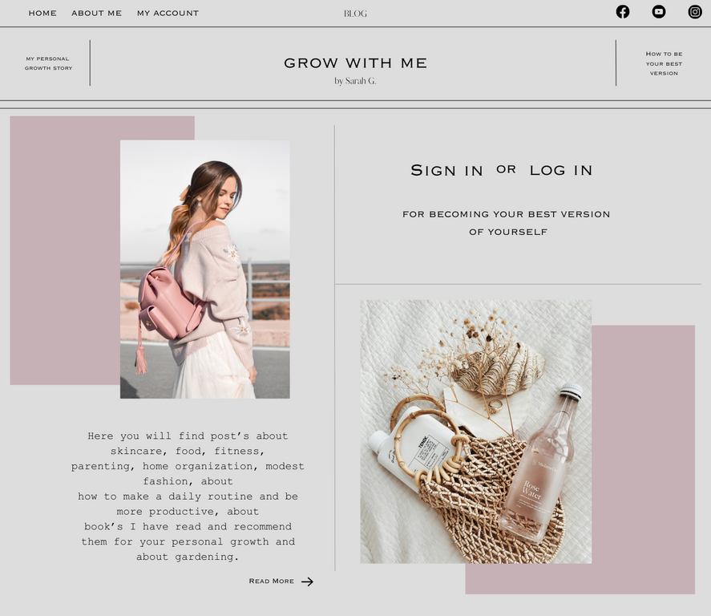
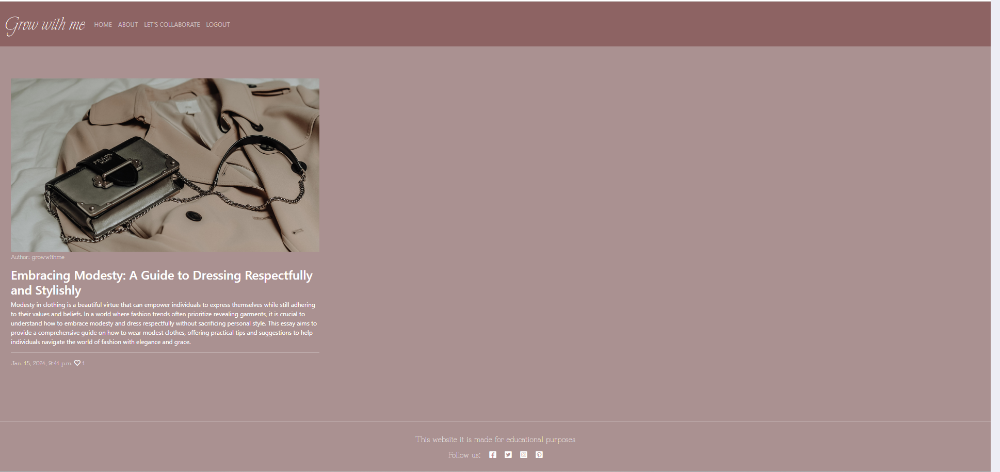

# Grow With Me

[Link to the website](https://growwithme-33cbf82d7376.herokuapp.com/)

## Table of Contents

0. [About](#about)

1. [Project Goals](#project-goals)

   1. [User Goals](#user-goals)

2. [User Experience](#user-experience)

   1. [Target Audience](#target-audience)
   2. [User Requirements and Expectations](#user-requirements-and-expectations)
   3. [User Stories](#user-stories)
   4. [Site Owner Stories](#site-owner-stories)

3. [Wireframes](#wireframes)
4. [Technologies Used](#technologies-used)

   1. [Languages & Frameworks](#languages--frameworks)
   2. [Libraries & Tools](#libraries--tools)
   3. [All Libraries for Deployment](#all-libraries-for-deployment-in-heroku)

5. [Design](#design)

   1. [Colors](#colours)
   2. [Fonts](#fonts)

6. [Project Structure](#project-structure)

   1. [Web Pages](#web-pages)
   2. [Code Structure](#code-structure)

7. [Agile Design](#agile-design)

8. [Database](#database)

   1. [Data Models](#data-models)

9. [Features](#features)

   1. [Implemented Features](#implemented-features)
   2. [Features To Be Implemented](#features-to-be-implemented)

10. [Validation](#validation)

    1. [CSS](#css)
    2. [HTML](#html)
    3. [Python](#python)
    4. [JS](#js)
    5. [Lighthouse](#lighthouse)

11. [Testing](#testing)

12. [Deployment](#deployment)

    1. [Creating database using ElephantSQL](#creating-database-using-elephantsql)
    2. [Deploying in Heroku](#deploying-the-website-in-heroko)
    3. [Forking of Github repo](#forking-the-github-repository)
    4. [Cloning the Github repo](#cloning-the-repository-in-github)

13. [Credits](#credits)

    1. [Content](#content)
    2. [Media](#media)
    3. [Code](#code)

14. [Thank You](#thank-you)

# About

- Grow With Me is a blog for lifestyle helping people with different categories like Parenting, Skincare, how to choose Modest Fashion and books recommandation for personal growth
- The website is build so that user can add posts choosing to write in one of these four categories

# Project Goals

Primary goals of the project (web app):

- Give users  an online platform to read helpful posts about lifestyle
- Enable users to express themselves through a written form Comment or Stories

## User Goals

- Ability to share their stories
- Be able give an opinion on a topic
- Ability to amend and update content
- Able to add, edit and delete their comments
- Able to like or unlike to posts
- Able to collaborate by filling out the collaboration form

## User Experience

### Target Audience

- People around the world who need help or who want to grow personaly
- Individuals who want to share their stories to the world

### User Requirements and Expectations

- Blog with a clear purpose
- An user-friendly interface that allows quick and efficient navigation
- Responsive and visually good design
- Engaging content within the limits of set categories

### User stories

1. As a Site User I want the navigation to be user-friendly so that I'm able to easily navigate through the blog content.
2. As a Site User I want to know info on what the app is about so that I can use its functionality for mutual benefit
3. As a Site User I can be able to register, login and logout from the website so that I can have a safe environment to work with
4. As a Site User I can be able to send message so that I can have my opinion
5. As a Site User I can view the category so that I can choose in witch categorie I want to read a post
6. As a Site User I can click a story so that I can read the full post
7. As a Site User I can comment on the story so that I can be involved in conversation
8. As a Site User I can delete comments so that I can delete unwanted comments in my story and also my comments in other's stories
9. As a Site User I can add a story so that I can share my thoughts with different people
10. As a Site User I can edit my story so that I can change the content when I want
11. As a Site User I can be able delete my story so that I can delete my blog when needed
12. As a Site User I can be able to add my profile to the website so that I can interact comfortably
13. As a Site User I can be able to edit and update my profile so that I can change details whenever I want
14. As a Site User I can delete my posts if I decide that the posts is not good enought to publish
15. As a Site User I can delete my posts if I decide that the posts is not good enought to publish
16. As a site User I can put my post to draft if I decide to finish to write it in another day.

### Site Owner Stories

1. As a Site Owner I would like that authenticated users have full access to blog app and its functionality
2. As a Site Owner I would like that users can leave a message via collaboration form
3. As a Site Owner I would like that each authenticated user gets prompt messages when performing CRUD(Create,Read,Update,Delete) operations when using blog app.
4. As a Site Owner I would like to approve or disapprove comments on my posts

## Wireframes

- A wireframe was build before developing the website.
- This was done in Canva.
- I didn't have time to aply this design, but in th future I would like to make this blog design as I made in Canva 

Index Page

Conclusion Page

Register/Login Page

Dashboard Page

About Page

Collaboration Page

- I didn't thing first time to make a collaboration form so I made contact form in my design

Stories Page

Story Detail Page

# Technologies Used

## Languages & Frameworks

- HTML
- CSS
- Javascript
- Boostrap 5
- Python 
- Django

### Libraries & Tools

- Canva App was usedfor creating the multi-device mock-up at the top of this README.md file and design for my app
- [Bootstrap 5](https://getbootstrap.com/). This project uses the Bootstrap library for UI components (Buttons, Card, Footer, Pagination, Navbar)
- [Cloudinary](https://cloudinary.com/) to store static files
- [Summernote](https://summernote.org/) to style the admin page
- [Favicon.io](https://favicon.io) for making the site favicon
- [Chrome dev tools](https://developers.google.com/web/tools/chrome-devtools/) was used for debugging of the code and checking site for responsiveness
- [Font Awesome icons](https://fontawesome.com/) - Icons from Boostrap icons were used throughout the site
- [GitPod](https://www.gitpod.io/) was used for writing code and to push the code to GitHub
- [GitHub](https://github.com/) was used as a remote repository to store project code
- [Google Fonts](https://fonts.google.com/) - for typography in project

### All libraries for deployment in Heroku

- All libraries is stored in requirements.txt for deployment in heroku

All libraries

# Design

## Colours

The colours from the app is inspired from Canva

## Fonts

Google fonts "'Explora', sans-serif" is used for logo from the navbar and 'Grandiflora One', 'Lora' fonts were used for this project as it offers clean and legible design, which makes it easy to read on screens of different sizes and resolutions. It has a neutral appearance and doesn't have any distracting features that can make it difficult to read.

## Project Structure

### Web Pages

The web pages are easy to navigate and consists of various pictures for better visual of the website.

### Sections

##### Index page

- A navbar with nav-items to navigate to various pages in the website
- Hero Section consist of two images and a button to redirect user to conclusion page
- Our Conclusion page explain about what is this blog app
- Footer with copyrights ,social media and useful navigation links

##### Conclusion Page

- A navbar with nav-items to navigate to various pages in the website
- A section with story post about the blog app
- Footer with social media and useful navigation links

##### Register/Login Page

- A navbar with nav-items to navigate to various pages in the website
- A form for register/login
- Footer with social media and useful navigation links

##### Dashboard Page

- A navbar with nav-items to navigate to various pages in the website
- A menu with four categories (Books Recommendation, Modest fashion, Skincare and Parenting)
- Footer with social media and useful navigation links

##### About Page

- A navbar with nav-items to navigate to various pages in the website
- Story of the site owner and a picture
- Footer with social media and useful navigation links

##### Our Stories Page

- A navbar with nav-items to navigate to various pages in the website
- A card display of stories written by users
- Footer with social media and useful navigation links

##### Our Stories Page

- A navbar with nav-items to navigate to various pages in the website
- Cards display of stories written by users
- Footer with social media and useful navigation links

##### Story Detail Page

- A navbar with nav-items to navigate to various pages in the website
- Posts display of stories written by users with images
- A Comment form
- Like or Dislike posts button
- Comments posted or waiting approval
- Edit or delete buttons for comments
- Footer with social media and useful navigation links

##### Collaboration Page

- A navbar with nav-items to navigate to various pages in the website
- A collaboration form to collaborate with the site owner

##### Logout Page

- A navbar with nav-items to navigate to various pages in the website
- A text asking user if it's shure that he want to logout and a button to logout

### Code structure

Project code structure is organized and constructed using Django Framework

#### Project Apps

- Blog app - constructed to deliver basic information for the User about the app with simple an intuitive navigation(links in nav-bar and footer to navigate throughout the app).

  It also provides the following functionalities:

  1. basic collaboration form for user to send a collaboration request and a footer
  2. user authentication and profile management functionality, full CRUD functionality, so user can create an account, update profile, upload supporting images for a profile

  3. the structure includes the necessary files for running the application, including the views, models, and templates required to create, read, update, and delete blog posts and comments.

#### Other django apps

- **settings.py**: This file contains configuration settings for your Django project, such as database settings, installed apps, and middleware.
- **Procfile**: This file is used to specify the commands that should be executed when your Django app is deployed on a hosting platform.
- **static**: This directory contains the base CSS JavaScript files and media
- **templates**- base-level folder with basic templates extended throughout other templates like: base.html, index.html, dashboard.html and others, also templates for user authentication.
- **requirements.txt**: This file lists the dependencies required for the Django project to run.
- **env.py**: This file is used to store environment variables for a Django project or application, such as database connection details or API keys.

##### Back to [top](#table-of-contents)

## Agile design

### About

- Agile development is the most effective way to development of any website
- It was my first attempt and I found it very challenging but somehow was able to do basic development in agile environment
- I forgot to set milestones in first instance and started the project without it. Hopefully in upcoming projects, I can be able to do it better.
- I have followed the "Think Before I Blog" project by Code Institute and just did it wth User story template.
- I was able to provide labels to user stories but in later stage of project
- I am aware that planning can be better and clear and will be implementing the agile development better from next project.

## Database

---

(ERD)Physical database model

- This sample ERD diagram was made using [Lucid Charts](https://www.lucidchart.com)
- For this Django app I ve used PostgreSQL relational database management system.
- model showed on the diagram visually represents the structure of a PostgreSQL database, including tables, columns, relationships, and constraints, that is stored in the database itself.

### Data Models

#### User Model

- User model as part of the Django allauth library contains basic information about authenticated user and contains folowing fields:
  Username, Password, Email

#### Profile model

- Profile model is created for user to add their details and image for better interaction with the website

| Name          | Database Key  | Field Type      | Validation                          |
| ------------- | ------------- | --------------- | ----------------------------------- |
| user          | user          | OneToOneField   | User, on_delete=models.CASCADE      |    |
| first_name    | first_name    | CharField       | max_length=50 blank=True            |
| last_name     | last_name     | CharField       | max_length=50 blank=True            |
| email         | email         | EmailField      | max_length=100 null=True blank=True |

#### Post model

- Post model is created for user to add a story with a image

| Name        | Database Key | Field Type      | Validation                                         |
| ----------- | ------------ | --------------- | -------------------------------------------------- |
| title       | title        | CharField       | max_length=200, unique=True                        |
| author     | author      | ForeignKey      | User, on_delete=models.CASCADE, related_name="blog_posts"                     |
| slug        | slug         | SlugField       | max_length=200, null=True, unique=True, blank=True |
| category        | category         | ForeignKey      |      Category, on_delete=models.CASCADE, default=None, null = True                                              |
| status      | status       | IntegerField    | choices=STATUS, default=0                          |
| featured_image | featured_image  | CloudinaryField | 'image', default='placeholder'                     |
| created_on  | created_on   | DateTimeField   | auto_now_add=True                                  |
| likes  | likes   | ManyToManyField   | User, related_name='blog_likes', blank=True  
| excerpt  | excerpt   |TextField   | blank=True  
| updated_on  | updated_on  | DateTimeField   | auto_now=True
| pub_date  | pub_date   |DateTimeField   | default=timezone.now                                  |

#### Comment model

- Comment model was created for user to comment on a story

| Name           | Database Key   | Field Type    | Validation                                                       |
| -------------- | -------------- | ------------- | ---------------------------------------------------------------- |
| name         | name         | CharField    |     |
| created_on     | created_on     | DateTimeField | auto_now_add=True                                                |
| post | post | ForeignKey    | Post, on_delete=models.CASCADE, related_name='comments'                                                    |
| approved       | approved       | BooleanField  | default=True     
| email         | email         | EmailField    |    
| body        | body        | TextField    |  
 |                                                |

 #### Collaboration model

- Collaboration model was created for user to send a collaboration request

 | Name           | Database Key   | Field Type    | Validation                                                       |
| -------------- | -------------- | ------------- | ---------------------------------------------------------------- |
| name         | name         | CharField    |   max_length=200  |
| email         | email         | EmailField    |                                               |
| message | message | TextField    |            |  
| read        | read        | BooleanField    |  default=False
 |                                                |

  #### About model

- About model was created for user to add some details about himself

 | Name           | Database Key   | Field Type    | Validation                                                       |
| -------------- | -------------- | ------------- | ---------------------------------------------------------------- |
|  title         |  title         | CharField    |   max_length=200  |
| updated_on  | updated_on  | DateTimeField   | auto_now=True
| content | content | TextField    |            |  
 |                                                |

   #### Category model

- Category model was created for user to see a category menu and find easier about what he wants to read

 | Name           | Database Key   | Field Type    | Validation                                                       |
| -------------- | -------------- | ------------- | ---------------------------------------------------------------- |
| name         | name         | CharField    |   max_length=200  |
|  description  | description  | TextField   | 
 |                                                |

 ## Features

---

### Implemented Features

#### Navbar

- Navbar consists of Logo and is displayed in all pages for easy navigation of website
- An unauthenticated user can see additional functions as follows:
   - Navbar with home page(Index page), register page and login page

- Authenticated user can see additional functions as follows:
  - Navbar with home page(Dashboard page), about page, collaboration page and signout page 
- Navbar is fully responsive and on smaller screen sizes it coverts into a 'Hamburger menu'

  - 

See Navbar

#### Footer

- Footer consists of social media links and a copyrights message

See Footer

#### Index Page

- This is the first contact with user when user opens the website
- It consists of navbar, hero-section and a footer
- This page have a title, some nice images, a short text and a button that redirects the user to conclusion page

See Index page

#### Conclusion Page

- This is conclusion page where user can know more about this blog page 
- It consists of navbar, hero-section and a footer
- At the end of this page is a button 'Go Back' that redirects the user to index page

See Conclusion Page

#### Register Page

- This feature is presenting register form wich is a part of django-allauth
- This is register page where user can register
- It consists of navbar, hero-section and a footer

See Register Page

#### Login Page

- This feature is presenting login form wich is a part of django-allauth
- This is login page where user can login if he already register once
- It consists of navbar, hero-section and a footer

See Login Page

#### Dashboard Page

- This is the first contact with user when user register or log in
- It consists of navbar, hero-section and a footer
- This page have a menu with four categories: Books Recommendation, Modest Fashion, Skincare and Parenting where user can find easier post's about what they want to read

See Dashboard page

#### About Page

- This is the about page and the story is of site owner and also an image is added to this section 
- It consists of navbar, hero-section and a footer

See About page

#### Collaboration Page

- This is the collaboration page where user can send a collaboration form to the post  owner
- It consists of navbar, hero-section and a footer

See Collaboration page

#### Logout Page

- This feature is presenting logout form wich is a part of django-allauth
- This is logout page where user can logout
- It consists of navbar, hero-section and a footer

See Login Page

#### Books Page

- This is the books recommendation page for personal growth
- It consists of navbar, hero-section and a footer

See Books page

#### Books Detail Page

- This is the post detail page where user can read the post he selected to read
- It consists of navbar, hero-section and a footer

See Books Detail page

#### Modest Fashion Page

- This is the modest fashion page witch contains post's about modest fashion
- It consists of navbar, hero-section and a footer

See Modest Fashion page

#### Modest Fashion Detail Page

- This is the post detail page where user can read the post he selected to read
- It consists of navbar, hero-section and a footer

See Modest Fashion Detail page

#### Skincare Page

- This is the skincare page witch contains post's about skincare
- It consists of navbar, hero-section and a footer

See Skincare page

#### Skincare Detail Page

- This is the post detail page where user can read the post he selected to read
- It consists of navbar, hero-section and a footer

See Skincare Detail page

#### Parenting Page

- This is the Parenting page witch contains post's about parenting
- It consists of navbar, hero-section and a footer

See Parenting page

#### Parenting Detail Page

- This is the post detail page where user can read the post he selected to read
- It consists of navbar, hero-section and a footer

See Parenting Detail page

